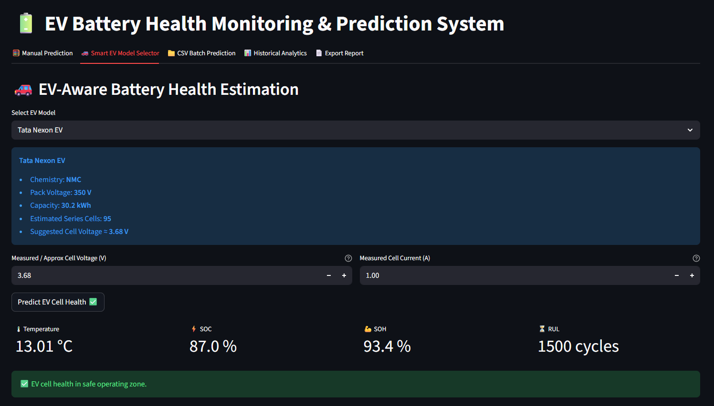

🔋 AIML-Based Advanced Predictive Model for Battery Health in Electric Vehicles

📌 Overview

This project implements an AI/ML-based predictive system to estimate the State of Health (SoH) of electric vehicle batteries using historical charge–discharge cycle data.
It includes data preprocessing, feature engineering, model training, evaluation, and a simple dashboard for analytics.

🎯 Objectives

Predict battery health degradation over time

Enable predictive maintenance for EV batteries

Visualize historical battery performance

🧠 Tech Stack

Python
Pandas, NumPy
Scikit-learn
Streamlit (for dashboard)
Pickle (for model saving)

📊 Dataset

Source: NASA Battery Dataset

Note: Due to large size (7565 CSV files + parquet), the dataset is not uploaded to GitHub.

You can download it from Kaggle:
👉 https://www.kaggle.com/datasets/patrickfleith/nasa-battery-dataset

## 🗂 Project Structure
```text
battery_health_project/
├── src/                  # ML pipeline and utilities
├── pages/                # Streamlit pages (analytics)
├── models/               # Trained model and metrics
├── Screenshots/          # Dashboard & results screenshots
├── app.py                # Streamlit app entry point
├── main.py               # (Reserved / future use)
├── requirements.txt      # Full dependency lockfile
├── requirements-min.txt  # Minimal deps for quick setup
└── .gitignore


🚀 How to Run
git clone https://github.com/vasantrj/battery-health-prediction-ev.git
cd battery-health-prediction-ev

# Quick setup (recommended)
pip install -r requirements-min.txt

# OR exact environment
pip install -r requirements.txt

streamlit run app.py

Recommended Python: 3.10 or 3.11

📈 Results

The trained model demonstrates effective prediction of battery health degradation trends and supports early detection of potential battery issues.
Model performance metrics are available in the models/metrics.json file.

📸 Screenshots
<p align="center">   </p>

👨‍💻 Author

Vasant Joshi
Final Year CSE Student | Data Science Intern

🔗 LinkedIn: https://www.linkedin.com/in/vasantjoshi  

🔗 GitHub: https://github.com/vasantrj

🔗 GitHub repo: https://github.com/vasantrj/battery-health-prediction-ev

🔮 Future Work

Improve feature engineering for battery degradation patterns

Deploy the dashboard using Streamlit Cloud

Add real-time data ingestion

Why these tweaks matter (quickly)

Code blocks make Project Structure and How to Run readable on GitHub

Small spacing fixes improve first impression

Clear “Recommended Python” avoids setup issues for others

Your screenshots now display nicely side-by-side 👀